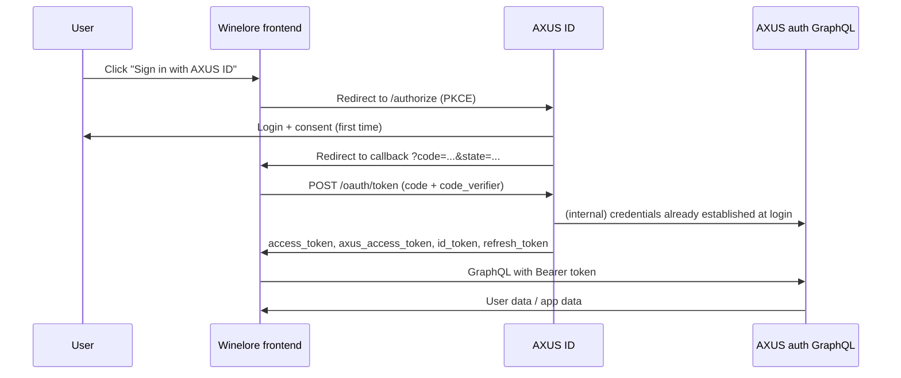

# Winelore frontend integration with AXUS ID

This guide explains how to integrate the **Winelore** frontend with **AXUS ID**, our OpenID Connect (OIDC) identity provider. After integration, Winelore users sign in through AXUS ID and receive tokens that authenticate them against the AXUS auth GraphQL backend.

AXUS ID handles login UI, consent, token issuance, and account management. Winelore only needs to implement the OAuth 2.0 Authorization Code flow with PKCE and store/use the returned tokens.

---

## What you get

| Capability | Provided by |
|---|---|
| Sign-in / sign-up UI | AXUS ID (`/login`, `/register`) |
| OAuth consent screen | AXUS ID (`/consent`) |
| OIDC discovery & JWKS | AXUS ID (`/.well-known/...`) |
| Access tokens for APIs | AXUS ID (`/oauth/token`) |
| User profile claims | `id_token`, `/oauth/userinfo`, or GraphQL |
| Token refresh & revoke | AXUS ID (`/oauth/token`, `/oauth/revoke`) |
| OAuth client registration | AXUS ID developer portal |

Winelore does **not** collect or store AXUS passwords. Users authenticate on AXUS ID and are redirected back to Winelore with an authorization code.

---

## Architecture



---

## Prerequisites

1. **AXUS ID base URL**
   - Local development: `http://localhost:3000`
   - Production: your deployed AXUS ID issuer (same value as `OAUTH_ISSUER`)

2. **AXUS auth GraphQL endpoint**
   - Local development: `http://localhost:8081/graphql`
   - Production: your deployed auth backend URL

3. **An OAuth client** registered for Winelore (see below).

4. **A callback route** in Winelore, e.g.:
   - `http://localhost:3001/auth/callback` (local)
   - `https://winelore.example.com/auth/callback` (production)

AXUS ID clients are **public** (no client secret). PKCE (`S256`) is required.

---

## Step 1 — Register an OAuth client

### Option A: Developer portal (recommended)

1. Create an AXUS ID account at `/register` if needed.
2. Sign in at `/login`.
3. Open **Developer portal → OAuth clients**: `/developer/oauth/clients`.
4. Click **Register an app** and fill in:
   - **App name**: `Winelore`
   - **Redirect URIs**: one URI per line (must match exactly, including scheme and port)
   - **Allowed scopes**: enable at least `openid` and `profile`; add `offline_access` if Winelore needs refresh tokens

5. Copy the generated **Client ID** (UUID). There is no client secret.

### Option B: Local dev seed client

For quick local testing only, AXUS ID seeds a shared dev client:

| Field | Value |
|---|---|
| `client_id` | `axusid-dev` |
| Redirect URIs | `http://localhost:3001/callback`, etc. |

Use a dedicated Winelore client in production.

### Redirect URI rules

- Must be registered exactly (no wildcards).
- Must not contain URL fragments (`#...`).
- In production, URIs must use **HTTPS** (except `localhost` / `127.0.0.1`).

---

## Step 2 — Configure Winelore environment

Add these to Winelore's environment (names are suggestions):

```bash
# AXUS ID issuer — used for discovery and authorize redirects
NEXT_PUBLIC_AXUS_ID_ISSUER=http://localhost:3000

# OAuth client registered for Winelore
NEXT_PUBLIC_AXUS_ID_CLIENT_ID=<your-client-uuid>

# Winelore callback — must match a registered redirect URI
NEXT_PUBLIC_AXUS_ID_REDIRECT_URI=http://localhost:3001/auth/callback

# AXUS auth GraphQL — server-side only; never expose in browser bundles
AUTH_GRAPHQL_ENDPOINT=http://localhost:8081/graphql
```

Use server-only variables for token exchange and GraphQL calls from your backend/API routes.

---

## Step 3 — Discover OIDC metadata

Fetch discovery once at startup (or hard-code endpoints from your environment):

```http
GET {AXUS_ID_ISSUER}/.well-known/openid-configuration
```

Important fields:

| Field | Example |
|---|---|
| `issuer` | `http://localhost:3000` |
| `authorization_endpoint` | `{issuer}/authorize` |
| `token_endpoint` | `{issuer}/oauth/token` |
| `userinfo_endpoint` | `{issuer}/oauth/userinfo` |
| `jwks_uri` | `{issuer}/.well-known/jwks.json` |
| `revocation_endpoint` | `{issuer}/oauth/revoke` |

Supported scopes: `openid`, `profile`, `email`, `offline_access`.

---

## Step 4 — Implement sign-in (Authorization Code + PKCE)

### 4.1 Generate PKCE values

Generate a **code verifier** (43–128 characters, URL-safe) and an **S256 code challenge**:

```typescript
function base64UrlEncode(bytes: Uint8Array): string {
  return btoa(String.fromCharCode(...bytes))
    .replace(/\+/g, "-")
    .replace(/\//g, "_")
    .replace(/=+$/, "");
}

export function createPkcePair() {
  const verifierBytes = crypto.getRandomValues(new Uint8Array(32));
  const codeVerifier = base64UrlEncode(verifierBytes);

  // code_challenge = BASE64URL(SHA256(code_verifier))
  return { codeVerifier, codeChallengePromise: sha256Base64Url(codeVerifier) };
}

async function sha256Base64Url(value: string): Promise<string> {
  const digest = await crypto.subtle.digest(
    "SHA-256",
    new TextEncoder().encode(value),
  );
  return base64UrlEncode(new Uint8Array(digest));
}
```

Store `code_verifier` in **session storage** or an **HttpOnly cookie** tied to the login attempt. It must be available when the callback route runs.

### 4.2 Generate and store `state`

Generate a random `state` value, store it alongside the verifier, and validate it on callback to prevent CSRF.

### 4.3 Redirect to AXUS ID

Build the authorize URL:

```typescript
const params = new URLSearchParams({
  response_type: "code",
  client_id: process.env.NEXT_PUBLIC_AXUS_ID_CLIENT_ID!,
  redirect_uri: process.env.NEXT_PUBLIC_AXUS_ID_REDIRECT_URI!,
  scope: "openid profile offline_access",
  state,
  code_challenge: codeChallenge,
  code_challenge_method: "S256",
});

window.location.assign(
  `${process.env.NEXT_PUBLIC_AXUS_ID_ISSUER}/authorize?${params}`,
);
```

**Scope guidance for Winelore:**

| Scope | Purpose |
|---|---|
| `openid` | Required for OIDC; enables `sub` claim and `id_token` |
| `profile` | `preferred_username`, `name`, `given_name`, `family_name` |
| `email` | Accepted at consent time; **no email claim is returned yet** |
| `offline_access` | Enables `refresh_token` in the token response |

If `scope` is omitted, AXUS ID defaults to `openid`.

### 4.4 What happens on AXUS ID

1. If the user is not signed in → redirect to `/login` (username + password).
2. On first use of your client → redirect to `/consent` (scope approval).
3. AXUS ID issues a short-lived authorization code (5 minutes, single use).
4. User is redirected to your callback:

```
https://winelore.example.com/auth/callback?code=AUTH_CODE&state=STATE
```

On failure:

```
https://winelore.example.com/auth/callback?error=access_denied&error_description=...&state=STATE
```

Handle both success and error query parameters.

---

## Step 5 — Exchange the authorization code for tokens

**Perform this step on your server** (Next.js Route Handler, API route, or backend). Never call `/oauth/token` directly from browser JavaScript with live tokens in responses you cannot protect.

```typescript
const body = new URLSearchParams({
  grant_type: "authorization_code",
  code,
  redirect_uri: process.env.NEXT_PUBLIC_AXUS_ID_REDIRECT_URI!,
  client_id: process.env.NEXT_PUBLIC_AXUS_ID_CLIENT_ID!,
  code_verifier: storedCodeVerifier,
});

const response = await fetch(`${issuer}/oauth/token`, {
  method: "POST",
  headers: { "Content-Type": "application/x-www-form-urlencoded" },
  body,
});

const tokens = await response.json();
```

JSON bodies are also accepted by the token endpoint.

### Token response shape

```json
{
  "access_token": "<IdP-signed JWT>",
  "token_type": "Bearer",
  "expires_in": 3600,
  "scope": "openid profile offline_access",
  "axus_access_token": "<opaque backend bearer>",
  "id_token": "<JWT when openid scope granted>",
  "refresh_token": "<wrapped token when offline_access granted>"
}
```

### Which token to use

| Token | Use in Winelore |
|---|---|
| `axus_access_token` | **Recommended** for AXUS GraphQL API calls. Opaque backend bearer. |
| `access_token` | IdP JWT; valid for GraphQL **and** `/oauth/userinfo`. Carries `scope` claim. |
| `id_token` | Parse client-side or server-side for identity claims (`sub`, profile fields). Verify signature via JWKS. |
| `refresh_token` | Store securely; use to obtain new tokens without re-login. |

Both `access_token` and `axus_access_token` authenticate GraphQL requests:

```http
Authorization: Bearer <token>
```

---

## Step 6 — Establish a Winelore session

After token exchange:

1. Validate `state` matches the value stored at sign-in.
2. Optionally validate `id_token` (signature via `{issuer}/.well-known/jwks.json`, check `aud` = your `client_id`, `iss` = issuer).
3. Store tokens in **HttpOnly, Secure, SameSite=Lax** cookies (or your server session store).
4. Map AXUS identity to Winelore's user record using `sub` (the user's **AUID**).

Minimal session payload:

```typescript
type WineloreSession = {
  auid: string;              // from id_token.sub or userinfo.sub
  accessToken: string;       // axus_access_token (preferred) or access_token
  refreshToken?: string;
  expiresAt: number;         // Date.now() + expires_in * 1000
  displayName?: string;      // from profile claims
};
```

Redirect the user to their intended destination within Winelore.

---

## Step 7 — Load user profile

### Option A: Decode `id_token` (fastest)

When `openid` scope is granted, the `id_token` JWT contains:

| Claim | Scope required | Notes |
|---|---|---|
| `sub` | `openid` | User AUID — stable primary identifier |
| `preferred_username` | `profile` | Default username |
| `name` | `profile` | Full name from default variation |
| `given_name` | `profile` | First name |
| `family_name` | `profile` | Last name |

Verify the JWT with the JWKS public key (`RS256`, kid `axusid-oauth-rs256`).

### Option B: UserInfo endpoint

```http
GET {issuer}/oauth/userinfo
Authorization: Bearer <access_token>
```

Requires `access_token` with `openid` scope. Returns the same profile claims as JSON.

### Option C: AXUS GraphQL (richest data)

Use the bearer token to query the auth backend directly:

```graphql
query Usernames($auid: ID!) {
  usernames(auid: $auid) {
    auid
    usernames
    defaultUsername
  }
}

query Variations($auid: ID!) {
  variations(auid: $auid) {
    id
    auid
    firstName
    lastName
    status
    description
    locationId
    icon
    createdAt
  }
}
```

Use this when Winelore needs variations, multiple usernames, or profile fields beyond OIDC claims.

---

## Step 8 — Call AXUS GraphQL from Winelore

All protected operations require:

```http
POST {AUTH_GRAPHQL_ENDPOINT}
Content-Type: application/json
Authorization: Bearer <axus_access_token or access_token>

{"query":"...","variables":{...}}
```

Winelore-specific backend queries (outside AXUS ID) should accept the same bearer tokens if they sit behind the auth backend or validate IdP JWTs.

**Do not** call `login` from Winelore when using OAuth — authentication already happened at AXUS ID during the authorize flow.

---

## Step 9 — Refresh tokens

When `offline_access` was requested and granted, store `refresh_token` securely.

```typescript
const body = new URLSearchParams({
  grant_type: "refresh_token",
  refresh_token: storedRefreshToken,
});

const response = await fetch(`${issuer}/oauth/token`, {
  method: "POST",
  headers: { "Content-Type": "application/x-www-form-urlencoded" },
  body,
});
```

The response has the same shape as the initial token response. Replace stored tokens atomically.

Refresh proactively before `expires_in` elapses (e.g. when `expiresAt - Date.now() < 5 minutes`).

---

## Step 10 — Sign out

### Winelore session

Clear Winelore cookies/session storage.

### Revoke AXUS refresh token (recommended)

```typescript
await fetch(`${issuer}/oauth/revoke`, {
  method: "POST",
  headers: { "Content-Type": "application/x-www-form-urlencoded" },
  body: new URLSearchParams({ token: refreshToken }),
});
```

The revoke endpoint returns `200` even if the token is unknown (RFC 7009).

Optionally redirect the user to AXUS ID account or home page. AXUS ID session cookies are separate from Winelore's; revoking the refresh token prevents Winelore from obtaining new access tokens without the user signing in again.

---

## Reference implementation (Next.js App Router)

Below is a minimal pattern matching AXUS ID conventions.

### `app/auth/login/route.ts` — start sign-in

```typescript
import { NextResponse } from "next/server";
import { cookies } from "next/headers";

export async function GET() {
  const { codeVerifier, codeChallenge } = await createPkcePair();
  const state = crypto.randomUUID();

  const cookieStore = await cookies();
  cookieStore.set("axus_oauth_state", state, { httpOnly: true, sameSite: "lax", path: "/" });
  cookieStore.set("axus_code_verifier", codeVerifier, { httpOnly: true, sameSite: "lax", path: "/" });

  const params = new URLSearchParams({
    response_type: "code",
    client_id: process.env.NEXT_PUBLIC_AXUS_ID_CLIENT_ID!,
    redirect_uri: process.env.NEXT_PUBLIC_AXUS_ID_REDIRECT_URI!,
    scope: "openid profile offline_access",
    state,
    code_challenge: codeChallenge,
    code_challenge_method: "S256",
  });

  return NextResponse.redirect(
    `${process.env.NEXT_PUBLIC_AXUS_ID_ISSUER}/authorize?${params}`,
  );
}
```

### `app/auth/callback/route.ts` — finish sign-in

```typescript
import { NextRequest, NextResponse } from "next/server";
import { cookies } from "next/headers";

export async function GET(request: NextRequest) {
  const params = request.nextUrl.searchParams;
  const error = params.get("error");
  if (error) {
    return NextResponse.redirect(new URL(`/login?error=${error}`, request.url));
  }

  const code = params.get("code");
  const state = params.get("state");
  const cookieStore = await cookies();
  const expectedState = cookieStore.get("axus_oauth_state")?.value;
  const codeVerifier = cookieStore.get("axus_code_verifier")?.value;

  if (!code || !state || !expectedState || state !== expectedState || !codeVerifier) {
    return NextResponse.redirect(new URL("/login?error=invalid_state", request.url));
  }

  const tokenResponse = await fetch(
    `${process.env.NEXT_PUBLIC_AXUS_ID_ISSUER}/oauth/token`,
    {
      method: "POST",
      headers: { "Content-Type": "application/x-www-form-urlencoded" },
      body: new URLSearchParams({
        grant_type: "authorization_code",
        code,
        redirect_uri: process.env.NEXT_PUBLIC_AXUS_ID_REDIRECT_URI!,
        client_id: process.env.NEXT_PUBLIC_AXUS_ID_CLIENT_ID!,
        code_verifier: codeVerifier,
      }),
    },
  );

  if (!tokenResponse.ok) {
    return NextResponse.redirect(new URL("/login?error=token_exchange", request.url));
  }

  const tokens = await tokenResponse.json();

  // Persist a Winelore session (example: HttpOnly cookies)
  cookieStore.set("axus_access_token", tokens.axus_access_token, {
    httpOnly: true,
    sameSite: "lax",
    secure: process.env.NODE_ENV === "production",
    path: "/",
    maxAge: tokens.expires_in,
  });

  if (tokens.refresh_token) {
    cookieStore.set("axus_refresh_token", tokens.refresh_token, {
      httpOnly: true,
      sameSite: "lax",
      secure: process.env.NODE_ENV === "production",
      path: "/",
      maxAge: 60 * 60 * 24 * 30,
    });
  }

  cookieStore.delete("axus_oauth_state");
  cookieStore.delete("axus_code_verifier");

  return NextResponse.redirect(new URL("/", request.url));
}
```

Adapt cookie names, session storage, and redirects to Winelore's routing.

---

## UX recommendations

| Element | Recommendation |
|---|---|
| Sign-in button | Link to your `/auth/login` route (server redirect), label e.g. **Sign in with AXUS ID** |
| Registration | Link to `{AXUS_ID_ISSUER}/register` for new users, or rely on AXUS ID login page footer |
| Account settings | Link to `{AXUS_ID_ISSUER}/account` for password, usernames, and profile variations |
| Error display | Map `access_denied` to "Sign-in cancelled"; other errors to a generic retry message |
| Deep links | Preserve intended post-login URL in a cookie/query param before starting OAuth |

Users sign in with their **username** (not AUID). AXUS ID resolves the username to an AUID internally.

---

## Error handling checklist

| Scenario | Query param / response | Winelore action |
|---|---|---|
| User cancels consent | `error=access_denied` | Show cancellation message |
| Invalid or expired code | Token endpoint `invalid_grant` | Restart sign-in |
| PKCE mismatch | Token endpoint `invalid_grant` | Restart sign-in; verify verifier storage |
| Redirect URI mismatch | Authorize or token error | Fix client registration |
| Invalid scope | `error=invalid_scope` | Adjust requested scopes or client allowed scopes |
| Expired access token | GraphQL 401 | Refresh or re-authenticate |

Always validate `state` on callback before exchanging the code.

---

## Local development workflow

1. Run AXUS ID: `npm run dev` → `http://localhost:3000`
2. Run AXUS auth backend → `http://localhost:8081/graphql`
3. Register Winelore client with redirect URI `http://localhost:3001/auth/callback` (or your local port).
4. Run Winelore on the matching port.
5. Click sign-in → complete login/consent on AXUS ID → land on Winelore callback with tokens.

For a quick smoke test without registering a client, use seeded `axusid-dev` if your callback URI is listed in the seed config.

---

## Production checklist

- [ ] Register a **production** OAuth client (do not ship `axusid-dev`).
- [ ] Set `NEXT_PUBLIC_AXUS_ID_ISSUER` to the production AXUS ID URL.
- [ ] Register **HTTPS** callback URIs only.
- [ ] Store refresh tokens in HttpOnly, Secure cookies or server-side session store.
- [ ] Implement token refresh before expiry.
- [ ] Revoke refresh tokens on sign-out.
- [ ] Verify `id_token` signature and `aud`/`iss` if you rely on ID token claims for authorization.
- [ ] Use `sub` (AUID) as the stable user key in Winelore's database.
- [ ] Never expose `AUTH_GRAPHQL_ENDPOINT` secrets or backend tokens in client bundles.

---

## Quick reference

| Resource | URL |
|---|---|
| OIDC discovery | `{issuer}/.well-known/openid-configuration` |
| JWKS | `{issuer}/.well-known/jwks.json` |
| Authorize | `{issuer}/authorize` |
| Token | `{issuer}/oauth/token` |
| UserInfo | `{issuer}/oauth/userinfo` |
| Revoke | `{issuer}/oauth/revoke` |
| Developer portal | `{issuer}/developer/oauth/clients` |
| User registration | `{issuer}/register` |
| Account management | `{issuer}/account` |

---

## Support & schema changes

- GraphQL operations available to authenticated clients are defined in AXUS ID's auth schema (`login`, `refreshCredentials`, `variations`, `usernames`, etc.).
- The `email` OIDC scope is reserved; no email claim is emitted until the backend exposes one.
- OIDC scopes (`openid`, `profile`, …) are **not** AXUS hierarchical permissions — they control consent and JWT claims only.

For Winelore-specific backend permissions (if added later), contact the AXUS platform team — custom scopes beyond the supported set require coordination on both AXUS ID client configuration and auth backend permission models.
